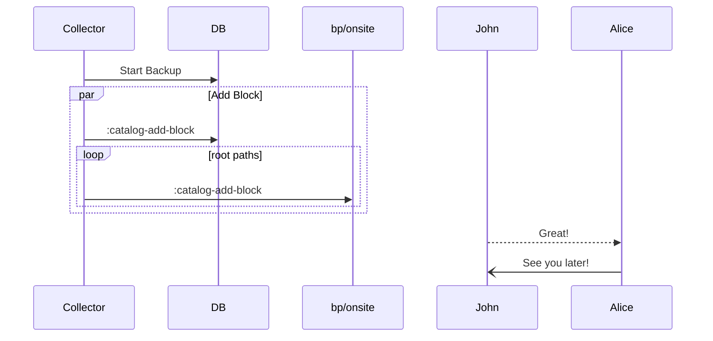
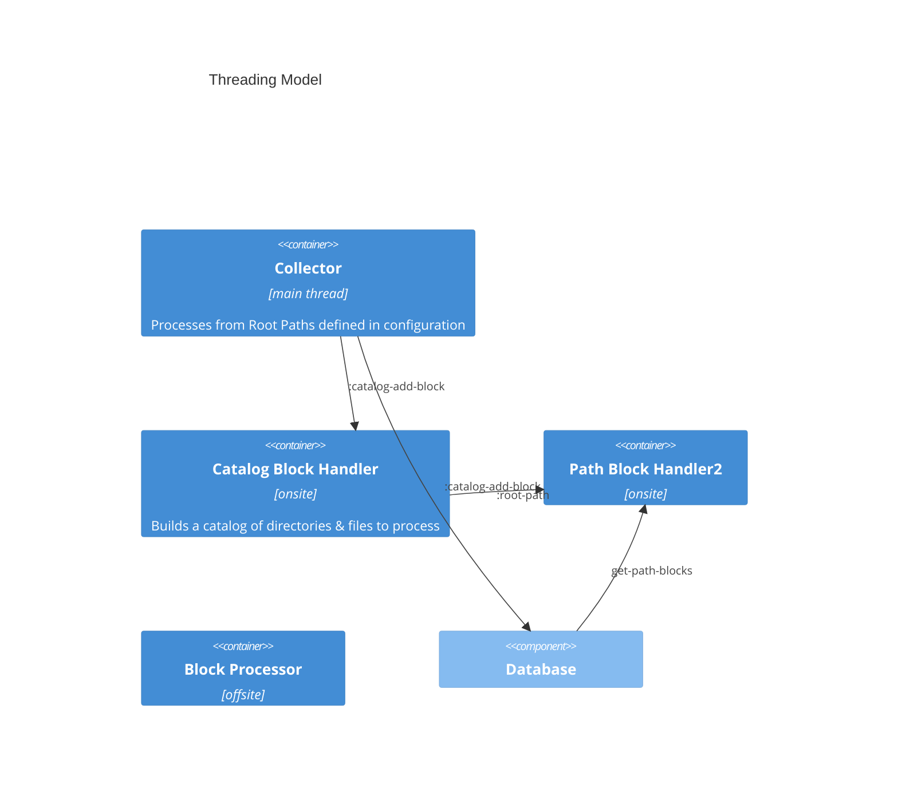

# Offsite Client

The Offsite Client keeps a catalog of the directories and files that have been designated for offsite backup. A list 
of backup directories/files and exceptions is maintained in the file backup-paths.edn, here is an example of what it 
might look like:

    {:globals {:exclusions  ["glob:*.DS_Store" "regex:.*nobackup.*"]}
     :paths   [{:path       "test/backup-data/active/du.out"}
               {:path       "test/backup-data/active/music" 
                :exclusions ["medium/" "large/" "glob:extra-small/*.xcld"]} 
               {:path       "test/backup-data/active/photos" 
                :exclusions ["DSC_0011.JPG" "DSC_0012.JPG" "DSC_0014.JPG" "DSC_0014.JPG" "DSC_0015.JPG" "DSC_0016.JPG" "DSC_0017.JPG" "DSC_0018.JPG" "DSC_0019.JPG" "DSC_0020.JPG" "DSC_0021.JPG" "DSC_0022.JPG" "DSC_0023.JPG" "DSC_002.JPG"]}]} 

This configuration shows two examples of global exclusions with different matching styles (glob and regex). The first 
says to ignore anything ending in “.DS_Store” and anything containing the string “nobackup”. The file also shows that 
there are three directories that should be backed up with local exclusions designated by names or a glob. 

## Events
The Offsite system is very event driven system, so it is imperative to have an understanding of the general flow of the 
application since many things can happen in an asynchronous fashion. I'm trying to focus more on [Manifold](https://github.com/clj-commons/manifold)
than just [core.async](https://github.com/clojure/core.async) for now.

### Collector

The collector acts as the orchestrator for the cataloging of files on the local system that will need to be backed up. 
It will walk the backup paths and compare the files and directories to the exclusion lists and the data found in the 
database to build a list of files to be backed up if they've changed. The [Babashka FS library](https://github.com/babashka/fs)
is used to manage walking through the backup paths.

For each file found on a backup path an onsite block will be created if it is to be backed up. The onsite block is 
added to the catalog and stored in the DB for later processing

